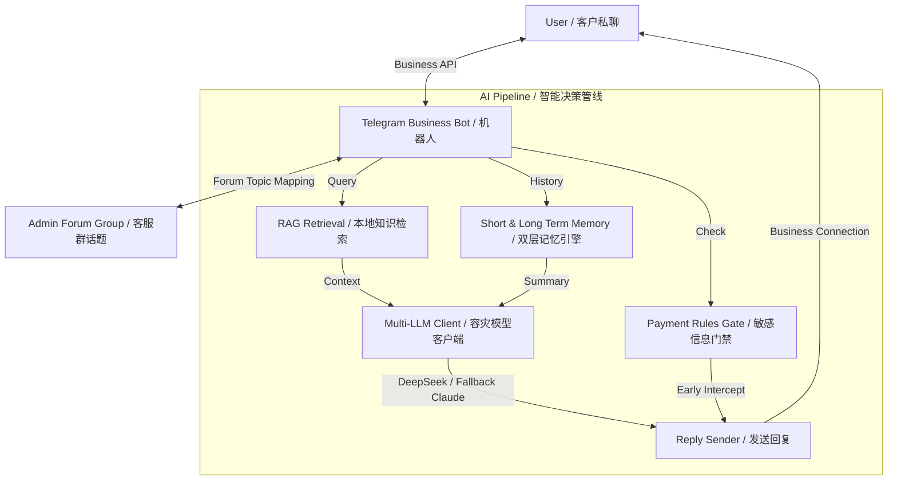

# Web3 Intelligent Bidirectional Telegram Bot (TG Business AI Customer Support)
# Web3 智能双向接待机器人 (Telegram Business AI 智能客服系统)

<div align="center">
  <p>
    <a href="https://github.com/ChiSonKon/telegram-business-ai-bot"></a>
    <a href="https://github.com/ChiSonKon/telegram-business-ai-bot/blob/main/LICENSE"></a>
    
    
  </p>
  <p>
    <strong>Developed and Open Sourced by <a href="https://t.me/biqrxnxiYW">White Cat Studio (Web3Baimao)</a></strong><br>
    <strong>由 <a href="https://t.me/biqrxnxiYW">白猫工作室 (Web3Baimao)</a> 倾力打造并开源</strong>
  </p>
</div>

---

### [English] Introduction

This project is a **production-ready, enterprise-grade Telegram Business AI Assistant**. It leverages the native Telegram Business Connection API to intercept personal private chats and route them to an administrator group using topics (threads). It runs a full **RAG (Retrieval-Augmented Generation)** pipeline locally (using ChromaDB or custom search), manages context using short-term and long-term memory summary layers, and supports multi-LLM failover (DeepSeek, Claude, GPT, Ollama) to ensure 100% service uptime. 

#### Core Features
- **Dynamic Dual-Reception Mode**: Automatic AI pipeline replies to users. Administrators can take over the conversation with one click in the corresponding thread, pausing the AI. Releasing the takeover returns it to AI mode.
- **Local RAG & Scraper**: Performs semantic retrieval against a local database (`knowledge_base.json`), injecting matched context into LLM prompt on the fly. Includes an automated periodic scraper to parse website/card contents.
- **Failover & Multi-LLM Support**: Built-in HTTP request layer with retry mechanisms and multi-LLM failover lists. If the primary model (e.g., DeepSeek) fails, it automatically falls back to secondary models (e.g., Claude/GPT) to prevent disruption.
- **Advanced Anti-Spam (Captcha)**: Protects the customer support channel by asking new users to solve a custom image captcha before opening human or AI channels.
- **Interactive Admin Control Panel**: Control welcome messages, inline/reply buttons, Prompt configurations, runtime parameters, and broadcast campaigns using `/admin` directly inside Telegram.

---

### [中文] 项目简介

本项目是一款**面向生产环境的企业级 Telegram Business AI 智能接待客服系统**。它利用原生的 Telegram Business 接口，实现将用户的私人会话双向同步至客服后台群组的话题（Topic）中。底层搭载了 **RAG (检索增强生成)** 技术，配合短期记忆与长期汇总记忆链，支持主流大模型（DeepSeek、Claude、GPT、Ollama 等）的容灾自动切换，解决大厂风控封号及大并发宕机痛点，为 Web3 团队及各类高净值商家提供安全、稳定的客户接待方案。

#### 核心特性
- **双向协同接管 (AI + 人工)**：默认由 AI 基于知识库与客户对话。客服可在后台话题内随时一键接管对话，AI 自动静默；人工处理完毕后可一键释放，AI 重新上线。
- **本地向量 RAG 与数据同步**：基于 `knowledge_base.json` 进行精准上下文关联检索，拒绝 AI 胡言乱语。内置自动爬虫脚本，可定时抓取落地页/发卡网的商品与价格。
- **多模型容灾负载均衡**：当主模型（如 DeepSeek）因风控或服务器限流报错时，系统会自动在毫秒级无感切换至备用模型（如 Claude 或自建大模型），确保业务永不掉线。
- **硬核防刷与女巫防御 (Captcha)**：内置图片式人机校验（验证码）模块，可有效阻挡各种机器人恶意私信与群发刷取，极大降低运营负担。
- **TG 动态后台控制面板**：管理员可通过 `/admin` 开启图形化菜单，实时热更新欢迎语、内联/底部按钮、提示词（Prompt）、限流策略并进行全局消息群发。

---

## Architecture & Data Flow / 系统架构与数据流向



---

## Feature Comparison / 功能对比

| Feature / 特性 | Traditional Bot / 普通客服机器人 | TG Business AI Bot / 本项目 |
| :--- | :--- | :--- |
| **API Interface** | Bot API (Users must start the bot) | Business API (Direct personal private chat) |
| **RAG Support** | None (Static FAQ match or generic LLM) | Dynamic semantic injection based on JSON / Scraper |
| **Failover Control** | None (Fails if the API key gets ratelimited) | Automatic failover to backup models |
| **Admin Operations** | CLI or external Web Panel | Visual Telegram UI (`/admin`) with full controls |
| **Anti-Spam** | None (Vulnerable to chat spamming) | Image Captcha Gate for human verification |

---

## Directory Structure / 项目结构

```text
.
├── interactive-bot/          # Main Bot Application / 机器人主程序
│   ├── handlers/             # Telegram Handlers (Commands, callbacks, business msgs)
│   ├── llm/                  # LLM Client & Failover Logic / 模型客户端与容灾
│   ├── memory/               # Context summary & session logs / 记忆树与上下文
│   ├── middleware/           # Rate limiter & state machine / 限流与状态机
│   ├── rag/                  # Retriever & Scraper / 向量检索与数据爬虫
│   └── start_settings.py     # Keyboard & Welcome configurator / 菜单按钮配置
├── db/                       # Database models (SQLAlchemy) / 数据库设计
├── assets/                   # Captcha images and SQLite DB / 图片与本地库
├── scripts/                  # Scraper & helper scripts / 辅助更新脚本
├── sales_system_prompt.txt   # System Prompt for AI / AI 销售提示词配置
├── knowledge_base.json       # Product & FAQ knowledge base / 业务知识库
├── deploy.py                 # Remote 1-click VPS deploy script / 自动打包部署脚本
└── requirements.txt          # Dependencies / 依赖库列表
```

---

## Quick Start / 快速开始

### 1. Requirements / 环境要求
- Python 3.10+
- Telegram Business Account (Premium) / 开启了 Telegram Premium 的个人或业务账号
- A Telegram Bot from [@BotFather](https://t.me/BotFather) / 申请好的 Bot Token

### 2. Installation / 安装
Clone this repository and install dependencies / 克隆项目并安装依赖:
```bash
git clone https://github.com/ChiSonKon/telegram-business-ai-bot.git
cd telegram-business-ai-bot

# Linux/macOS
python -m venv venv
source venv/bin/activate
pip install -r requirements.txt

# Windows
python -m venv venv
.\venv\Scripts\Activate.ps1
pip install -r requirements.txt
```

### 3. Environment Config / 环境变量配置
Copy `.env_example` to `.env` and fill in your keys / 复制 `.env_example` 并修改对应配置:
```bash
cp .env_example .env
```
Main variables to modify / 核心环境变量:
- `BOT_TOKEN`: The API token from BotFather
- `BOT_USERNAME`: The username of your Bot
- `ADMIN_GROUP_ID`: The ID of your private admin forum group (Enable topics in group settings)
- `ADMIN_USER_IDS`: Telegram IDs of admins (comma-separated) who can access `/admin`
- `LLM_API_KEY`: Your LLM key (DeepSeek, OpenAI, etc.)

### 4. Running / 启动运行
Run the bot locally / 本地运行:
```bash
python -m interactive-bot
```

To schedule the scraper to fetch remote shop info periodically, configure a cron job or run:
配置定时爬虫同步产品数据，直接运行或添加至系统计划任务:
```bash
python scripts/scrape_prices.py
```

---

## Web3 Baimao Studio / 关于白猫工作室

**White Cat Studio (Web3Baimao)** is a cutting-edge developer community focusing on Web3 applications, smart contracts, custom Telegram/Discord automation systems, and community growth utilities. 

We deliver robust, source-delivered, highly audited code for projects looking to streamline operations and enhance conversion with AI.

- **Official Channel / 官方反馈与更新频道**: [t.me/biqrxnxiYW](https://t.me/biqrxnxiYW)
- **Official Website / 业务官方网站**: [web3baimao.com](https://web3baimao.com/)
- **Core Developers / 联系主理人**: [@biqrxnxiYW](https://t.me/biqrxnxiYW) (Contact CS via Official Channel)

---

## License / 开源协议

This project is open-sourced under the **Apache License 2.0**. See the [LICENSE](./LICENSE) file for details.
本项目采用 **Apache License 2.0** 协议进行开源，允许自由修改与商业二次开发，请遵守开源协议注明来源。
