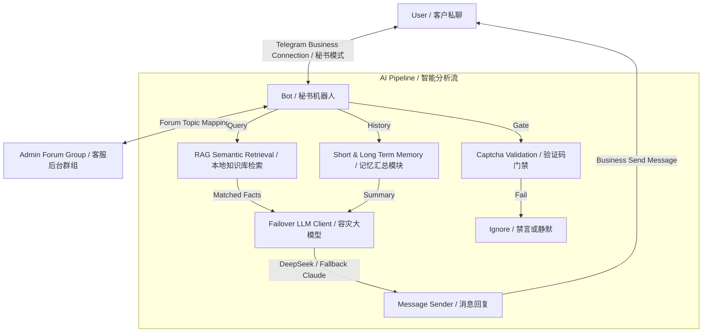

<h1 align="center">Telegram Business AI Bot 🤖</h1>

<p align="center">
  <a href="https://github.com/ChiSonKon/telegram-business-ai-bot/stargazers"></a>
  <a href="https://github.com/ChiSonKon/telegram-business-ai-bot/issues"></a>
  <a href="https://github.com/ChiSonKon/telegram-business-ai-bot/network/members"></a>
  <a href="https://github.com/ChiSonKon/telegram-business-ai-bot/blob/main/LICENSE"></a>
</p>

<p align="center">
  <strong>简体中文</strong> | <a href="#english">English</a>
</p>

<p align="center">
  <a href="https://core.telegram.org/bots/features#secretary-bots">
    
  </a>
</p>

<p align="center">
  <strong>只需通过 Telegram 官方 Business 接口将机器人绑定为个人账号的「聊天自动化 / 秘书机器人 (Secretary Bot)」，即可全自动托管您的私信会话。AI 智能决策回复、RAG 向量数据库语义检索、防刷人机验证码，并支持多模型自动容灾负载均衡。</strong>
</p>

---

## 💡 核心特性

- **秘书模式 (Secretary Mode) 聊天自动化**：基于 Telegram Business 最新推出的 [Secretary Bots 机制](https://core.telegram.org/bots/features#secretary-bots)。您可以直接在 Telegram App 的“设置 - Telegram 企业版 - 聊天机器人”中绑定您的专属秘书机器人（如 [@biqrxnxi_baimaoBOT](https://t.me/biqrxnxi_baimaoBOT)），无需将账号交给第三方，安全合规地托管您的个人私信。
- **人机验证防御 (Captcha Gate)**：当陌生人给您的个人/业务账号发送私信时，秘书机器人会自动对其发起图片验证码校验，拦截垃圾营销、群发广告与女巫攻击，通过后才放行 AI 对话或人工接入。
- **双向人工接管 (AI + Human Takeover)**：AI 客服与您协同接待。当有紧急客户或需要您亲自处理时，可在后台话题（Topic）群组内一键接管对话，此时 AI 会自动暂停；当您处理完毕后一键释放，AI 重新上线继续接待。
- **本地向量知识库 (RAG & Scraper)**：语义向量搜索引擎驱动。系统通过匹配 `knowledge_base.json` 中的产品、FAQ 以及通过定时爬虫（Scraper）抓取到的数据，注入大模型进行上下文关联回答，彻底告别 AI 幻觉和胡言乱语。
- **多模型容灾负载均衡 (Failover Client)**：专为生产环境设计的健壮连接层。主模型（如 DeepSeek）因风控、并发高或欠费报错时，系统会在毫秒级无感切换至备用模型（如 Claude 或 OpenAI），保证客户通道永远畅通。
- **TG 端内可视化后台**：无需登录任何 Web 网站，在 TG 内直接发送 `/admin` 即可打开控制菜单，支持动态调整欢迎语、自定义按钮配置、提示词配置、限流速率以及全局群发。

> [!TIP]
> **🚀 推荐组合：打造你的 Telegram 商业增长矩阵**
>
> 将本项目与 **TG 自动获客助手** 配合使用，打通多账号获客、活跃成员采集、社群运营、批量触达与 AI 私信客服，覆盖从引流、培育到成交转化的完整业务链路。
>
> 👉 **[点击获取 TG 自动获客助手](https://github.com/ChiSonKon/tg-sender-releases)**

---

## 🏗️ 架构与数据流向



---

## 🚀 快速开始

### 1. 环境要求
- Python 3.10+
- 拥有 Telegram Premium（企业版权限）的个人/业务账号 [点击自助购买TG企业会员支持微信/支付宝](https://t.me/biqrxnxi_tgYWbot) 
- 在 [@BotFather](https://t.me/BotFather) 处注册好的 Bot

### 2. 启用秘书模式 (Enable Secretary Mode)
1. 打开 Telegram，私聊 [@BotFather](https://t.me/BotFather)，发送 `/mybots`，选择你的 Bot。
2. 依次选择 **Bot Settings -> Business Connection -> Turn On** 启用 Business 绑定能力。
3. 打开你的 Telegram App，进入**设置 -> Telegram 企业版 -> 聊天机器人 (Chatbots)**，输入并添加你的机器人（例如 [@biqrxnxi_baimaoBOT](https://t.me/biqrxnxi_baimaoBOT)），选择允许访问的会话范围即可。

### 3. 安装与运行
```bash
git clone https://github.com/ChiSonKon/telegram-business-ai-bot.git
cd telegram-business-ai-bot

# 建议使用虚拟环境
python -m venv venv

# 激活环境 (Linux/macOS)
source venv/bin/activate
# 激活环境 (Windows PowerShell)
# .\venv\Scripts\Activate.ps1

# 安装依赖
pip install -r requirements.txt
```

### 4. 环境变量配置
```bash
cp .env_example .env
```
修改 `.env` 配置文件：
- `BOT_TOKEN`: 你的 Bot 授权 Token
- `BOT_USERNAME`: 你的 Bot 用户名（不带 @，如 `biqrxnxi_baimaoBOT`）
- `ADMIN_GROUP_ID`: 后台管理群组 ID（需开启 Topic 话题功能）
- `ADMIN_USER_IDS`: 允许访问 `/admin` 后台的管理员 Telegram ID（英文逗号分隔）
- `LLM_API_KEY`: 你的主要模型 API 密钥

### 5. 启动服务
```bash
# 启动机器人
python -m interactive-bot

# (可选) 定时抓取服务
python scripts/scrape_prices.py
```

---

<h2 id="english" align="center">English Introduction 🇬🇧</h2>

<p align="center">
  <strong>Just connect this bot to your account via Telegram's native Business Secretary interface to automate all incoming private messages. Features AI semantic RAG responses, failover model client, human verification, and admin group control.</strong>
</p>

### Key Features
- **Telegram Secretary Mode**: Built natively on top of Telegram Business's [Secretary Bots feature](https://core.telegram.org/bots/features#secretary-bots). Connect your bot under your Profile's chat automation settings without sharing your account credentials.
- **Captcha Gate**: Intercepts spam, bulk advertising, and Sybil attacks. Unverified accounts must pass a visual captcha before being routed to AI or human support.
- **RAG & Local Database**: Leverages semantic search on `knowledge_base.json` along with dynamic web scrapers, eliminating LLM hallucinations.
- **Failover Client**: Dynamically falls back from your primary model (e.g. DeepSeek) to Claude/OpenAI in milliseconds if errors or rate limits occur.
- **In-App Admin Panel**: Manage prompts, keyboards, welcomes, and broadcast campaigns natively inside TG via `/admin`.

---

## 👥 关于白猫工作室 (White Cat Studio)

白猫工作室（Web3Baimao）致力于高端 Web3 工具研发、智能合约安全性审计、Telegram/Discord 深度定制化机器人研发以及私域流量矩阵搭建。

我们倡导“硬核技术驱动、源码全交付、安全至上”的极客交付理念，助您在 Web3 与社群运营中快人一步。

- **官方技术频道 (Official Channel)**: [t.me/oxbaimao](https://t.me/oxbaimao)
- **业务官方网站 (Website)**: [web3baimao.com](https://web3baimao.com/)
- **联系主理人 (Contact Us)**: [t.me/oxbaimao](https://t.me/oxbaimao) (通过官方频道联系主理人)

---

## 📄 开源协议 (License)

本项目基于 **Apache License 2.0** 协议进行开源，详情请参阅 [LICENSE](./LICENSE)。
